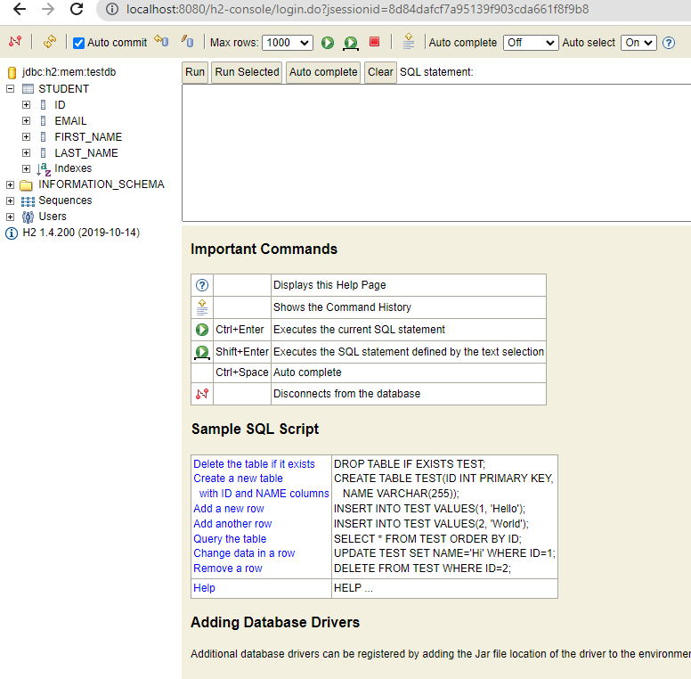

# Esercizio - Spring Boot - Mock DB
* scrivere un'applicazione Spring Boot con le dipendenze necessarie che:
  * prende in giro un database usando `h2` che ha `username`:`testdb` e `password`:`psw1234`
  * crea una tabella `Studente` con:
    * una chiave primaria
    * un `nome`
    * un `cognome`
    * un'e-mail univoca
* usa la `h2-console` con il tuo browser e connettiti al db
  * dovresti vedere qualcosa come la seguente immagine nel browser

# Exercise - Spring Boot - Mock DB
* write a Spring Boot application with the necessary dependencies that:
  * mocks a database using `h2` that has `username`:`testdb` and `password`:`psw1234`
  * creates a table `Student` with:
    * a primary key
    * a `firstName`
    * a `lastName`
    * a unique `email`
* use the `h2-console` with your browser and connect to the db
  * you should see something like the following pic in the browser

